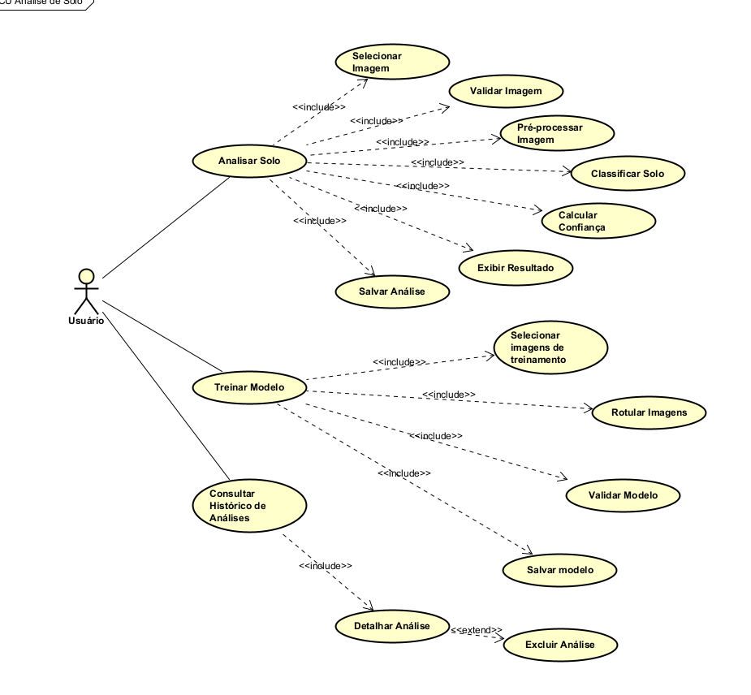
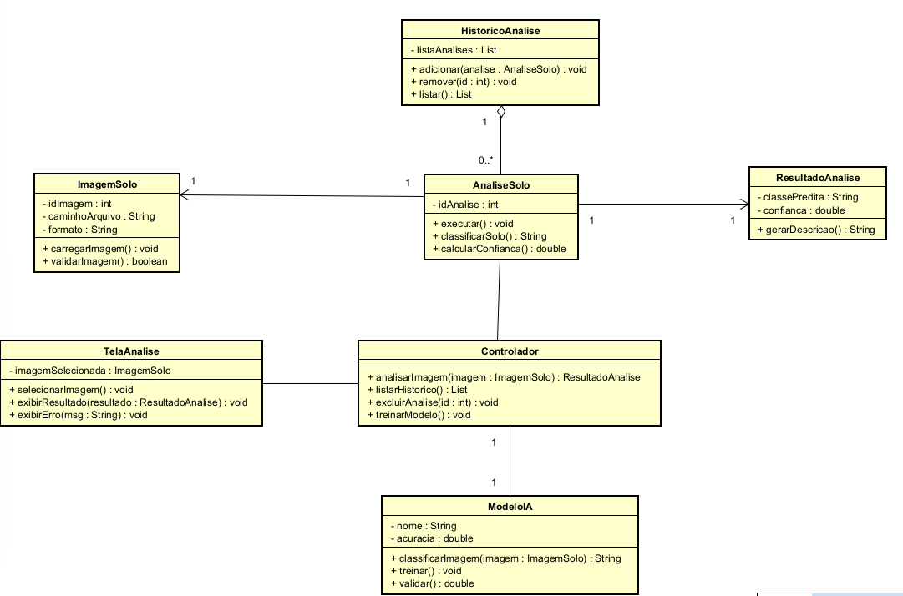

#  Solo Aurífero

Sistema de análise de imagens de solo com potencial aurífero

---

##  Descrição

O Solo Aurífero é um sistema desktop desenvolvido em Python com o objetivo de analisar imagens de solo e identificar, de forma automatizada, o potencial aurífero com base em características visuais extraídas por técnicas de Inteligência Artificial.

O projeto foi desenvolvido como parte da disciplina **Projeto de Sistemas Inteligentes** do curso de Engenharia da Computação, aplicando conceitos de Visão Computacional, Aprendizado de Máquina e Deep Learning para a classificação de imagens de solo.

A solução utiliza modelos de redes neurais convolucionais pré-treinados, como EfficientNetB0 e MobileNetV2, permitindo a realização de experimentos comparativos e a avaliação de métricas de desempenho. Além disso, o sistema disponibiliza uma interface gráfica desktop para análise de imagens, treinamento de modelos e visualização do histórico de classificações.

O projeto busca demonstrar a aplicação prática de técnicas de Inteligência Artificial na análise de características visuais de solos, contribuindo para estudos relacionados à prospecção mineral e à classificação automatizada de imagens.


---

## Objetivos

* Classificar imagens de solo em duas categorias:
  * Potencial Aurífero
  * Não Aurífero
* Aplicar técnicas de Visão Computacional e Deep Learning.
* Avaliar o desempenho de diferentes arquiteturas de redes neurais convolucionais.
* Armazenar e gerenciar o histórico de análises realizadas.
* Disponibilizar uma interface gráfica intuitiva para treinamento e inferência dos modelos.

---

## Tecnologias Utilizadas

* **Python** – linguagem principal de desenvolvimento.
* **CustomTkinter** – construção da interface gráfica moderna e responsiva.
* **TensorFlow / Keras** – treinamento e inferência dos modelos de Deep Learning.
* **EfficientNetB0** – modelo principal utilizado para classificação de imagens de solo.
* **MobileNetV2** – modelo utilizado para comparação experimental de desempenho.
* **SQLite** – armazenamento local de dados e histórico de análises.
* **Pillow (PIL)** – manipulação e exibição de imagens.
* **NumPy** – operações numéricas e manipulação de matrizes.
* **Git e GitHub** – versionamento e gerenciamento do código-fonte.

---

## Dataset

O conjunto de dados foi composto por imagens coletadas pelo autor utilizando um smartphone Samsung Galaxy S23 Ultra.

As imagens foram organizadas em duas classes:

| Classe | Quantidade |
|---------|------------|
| Potencial Aurífero | 372 |
| Não Aurífero | 244 |
| Total | 616 |

As imagens foram obtidas mantendo uma distância aproximada de 30 cm da superfície do solo, buscando padronizar as condições de aquisição.

## Modelos de Inteligência Artificial

O sistema utiliza Transfer Learning com modelos pré-treinados da ImageNet.

### EfficientNetB0

* Entrada: 224x224x3
* Transfer Learning
* Global Average Pooling
* Camadas Dense com Dropout

Resultados:

* Acurácia: 93,26%
* Precisão: 88,89%
* Recall: 100%
* F1-Score: 94,12%

### MobileNetV2

* Entrada: 224x224x3
* Transfer Learning
* Global Average Pooling

Resultados:

* Acurácia: 100%
* Precisão: 100%
* Recall: 100%
* F1-Score: 100%

##  Estrutura do projeto

O sistema segue uma estrutura modular organizada em camadas,
separando responsabilidades entre interface, regras de negócio,
inteligência artificial e persistência de dados.

```
solo_aurifero/
├── controller/           # Controladores responsáveis pelo fluxo da aplicação
│   ├── analise_controller.py
│   ├── historico_controller.py
│   └── treinamento_controller.py
│
├── ia/                   # Módulos de Inteligência Artificial
│   ├── classificacao.py
│   ├── pre_processamento.py
│   ├── teste_preprocessamento.py
│   └── treinamento_efficientnetB0.py
    └── treinamento_mobilenetV2.py

│
├── interface/            # Interface gráfica do sistema
│   ├── telas/
│   ├── componentes/
│   ├── tema/
│   ├── app.py
│   └── janela_principal.py
│
├── negocio/              # Regras de negócio da aplicação
│   ├── analise_service.py
│   ├── treinamento_service.py
│   ├── historico_service.py
│   └── arquivo_service.py
│
├── persistencia/         # Camada de persistência de dados
│   ├── database/
│   ├── model/
│   ├── repository/
│   └── data/
│
├── docs/                 # Documentação do projeto
│
└── main.py               # Ponto de entrada da aplicação
```

---


### Diagrama de Casos de Uso (DCU)


### Diagrama de Classes (DCL)


## Funcionalidades Atuais

### Análise

* Seleção de imagens
* Preview da imagem
* Classificação utilizando IA
* Exibição do percentual de confiança
* Registro automático no histórico

### Histórico

* Consulta das análises realizadas
* Visualização da imagem analisada
* Exclusão de registros

### Treinamento

* Treinamento do EfficientNetB0
* Treinamento do MobileNetV2
* Salvamento automático dos modelos
* Geração de métricas
* Matriz de confusão
* Curvas de treinamento

### Resultados

* Comparação entre modelos
* Visualização das métricas
* Dashboard com indicadores gerais do sistema

## Interface

O sistema possui uma interface gráfica desenvolvida com CustomTkinter contendo:

* Dashboard inicial
* Tela de análise
* Tela de histórico
* Tela de treinamento
* Tela de resultados
* Tela de comparação entre modelos

---

## ▶️ Como executar o projeto

### 1. Clonar o repositório

```
git clone https://github.com/Wesleyamd/solo_aurifero.git
```

### 2. Acessar a pasta

```
cd solo_aurifero
```

### 3. Criar ambiente virtual

```
python -m venv .venv
```

### 4. Ativar o ambiente

Windows:

```
.venv\Scripts\activate
```

### 5. Instalar dependências

```
pip install -r requirements.txt
```

### 6. Executar o sistema

```
python main.py
```

---

##  Estrutura de dados

As imagens analisadas são copiadas automaticamente para:

```
data/analise/
```

O banco de dados fica em:

```
data/banco/solo.db
```

---

## Funcionalidades Futuras

* Comparação entre diferentes arquiteturas de Deep Learning (EfficientNetB0, MobileNetV2 e outras).
* Ampliação da base de dados com imagens coletadas em diferentes regiões.
* Implementação de mapas de calor para interpretação visual das classificações.
* Geração automática de relatórios das análises realizadas.
* Exportação de resultados para PDF e planilhas.
* Integração com Firebase para armazenamento em nuvem.
* Desenvolvimento de aplicativo móvel para consulta das análises.
* Dashboard avançado com métricas de treinamento e desempenho dos modelos.
* Inclusão de novas classes de solo para aumentar a capacidade de generalização do sistema.
* Integração com dados geológicos e geoespaciais provenientes de bases públicas.


##  Autor

**Wesley Carvalho das Neves**
Engenharia da Computação - IFMT

---

##  Licença

Este projeto é acadêmico e está sendo desenvolvido para fins educacionais.
